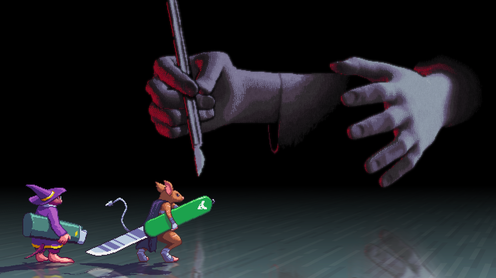

# Small Saga: Guts from Berserk is actually a cute mouse
Small Saga is an indie RPG developed mainly by the solo developer **Darya Noghani** over the period of 6 years. I first got to know about the game through the ever charming youtube channel reviewing funky games: **Grimbeard**.

The premise is simple, you are a small mouse on the quest to kill a god (it is an RPG after all). Through your journey you meet a bunch of misfits and get into a multitude of shenanigans, political intrigue, dubious activities and grand adventure as you 
inadvertently reshape rodent society around you.

Small saga is the closest i have seen a game come to my platonic ideal of an indie game as a product. It takes a well known and well worn gaming concept in the broader industry (RPGs), keenly observes its positive aspects as well as its shortcomings and then proceeds to condense it down to an extremely tight, well designed and polished experience.

As opposed to its AAA contemporaries, Small Saga does not have a play time in the hundreds of hours. It only spans 8-9 hours maximum. However, not a single second is wasted in these 8 hours. Every epic RPG I have played ends up having the dreaded *mid-game slump* where the main story has slowed down to a crawl and you have this 10-20 hour period where you are just going through the motions of interactions hoping that the plot eventually picks up. In the case of Small Saga, the shorter play time allows it maintain a breathless and consistent pace. Once it puts the pedal to metal, it does not let it go until the very end.

The whole game exudes confidence. It reflects of a developer well versed with all the intricacies of RPG mechanics and story telling. There is no grind involved here, you level up at specific trigger points in the plot. The game also does not have any expendable consumables (something I really suck at managing, as the hoards of potions in my DOS2 character inventory will attest to). The leveling system is a simple web with each progression providing meaningful improvements to character stats. From the equipment all the way to character skills, the name of the game here is **considerate streamlining**, something which allows the game to be incredibly approachable while still being engaging. Small Saga is a great gateway into the genre of RPGs and gaming in general while also having the ability to ensnare genre veterans into its world.

And what a world it is. It is the narrative and the world building surrounding the plot which elevates Small Saga from a good indie project to an absolute gem. The genius is in its ability to engage with the audience on their level of expectations. If you just want a story about adventure and high jinx, the game will leave thoroughly satisfied by the end. If you desire more nuanced narratives with capital T themes, Small Saga can confidently meet you there as well. It is a game where you fight a rhyming octopus one minute and then argue political and social theory the next. It is no Planescape Torment or Disco Elysium and neither is it trying to be one. But just like its mechanics, Small Saga takes the well worn tropes and traditions of conventional RPG story telling and cuts and polishes them until the final product is absolutely dazzling.

Smart and charming dialogue in tandem with absolutely beautiful pixel art allows Small Saga to conjure up a wonderful world, a living and breathing one which alludes to so much more than it actually shows. It has the ability to suck you in with the simplest of statements, and by the time I was finished with it I was craving for so much more.

All in all, Small Saga sits in a special pantheon of indie games for me with other titles such as Transistor and Outer Wilds. Games which to me show the essence of what a video game is. And even though it is not as medium transcending as Outer Wilds or as unique as Transistor, it will always hold the position of the **genre ambassador** for RPGs to me. Through the following months and years I will keep recommending this game to both gamers as well as non-gamers when trying to get them into RPGs. If nothing else in this overly verbose article convinced you, this should tell you how much I loved the game.